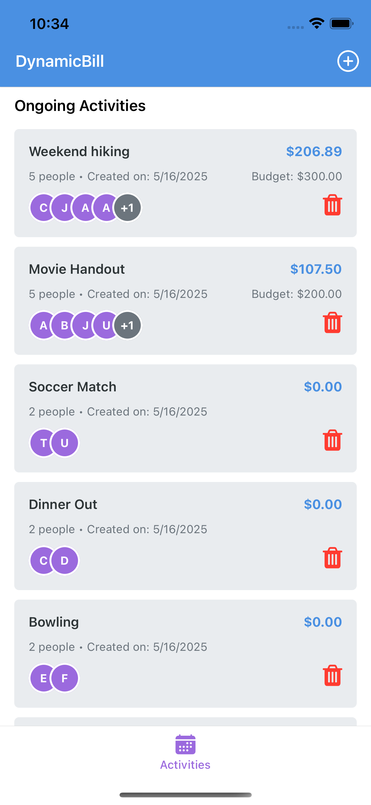
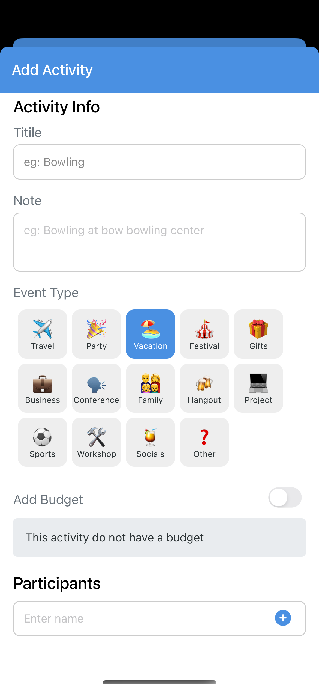
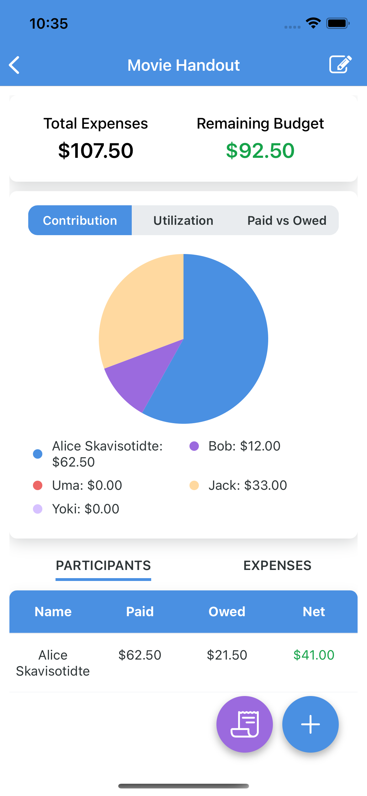
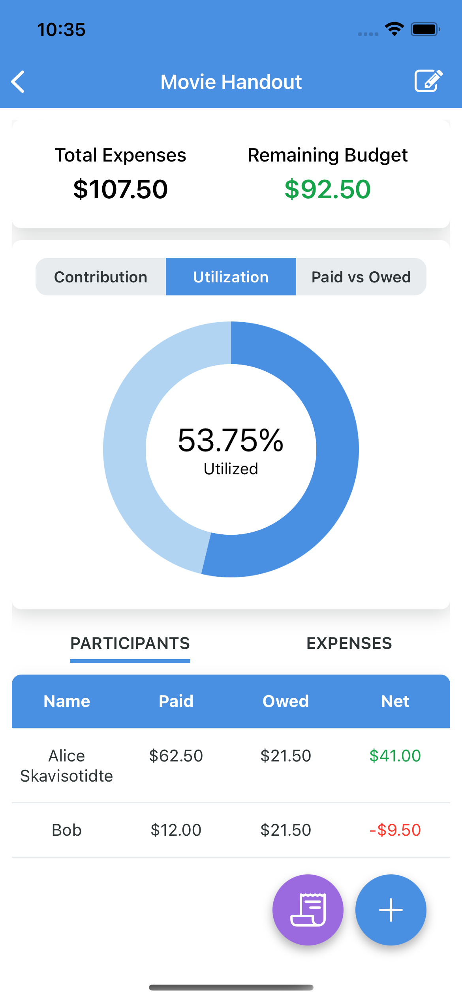
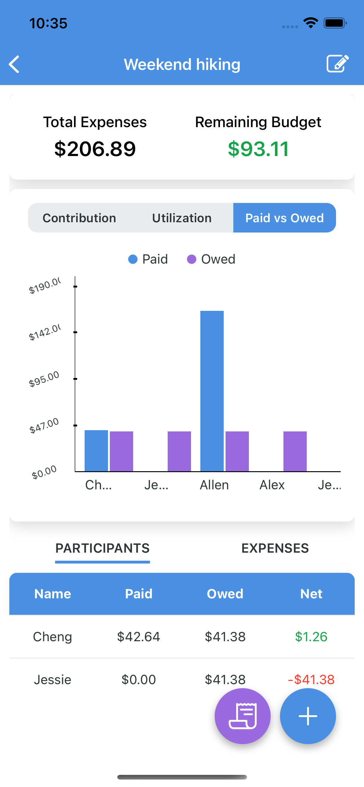
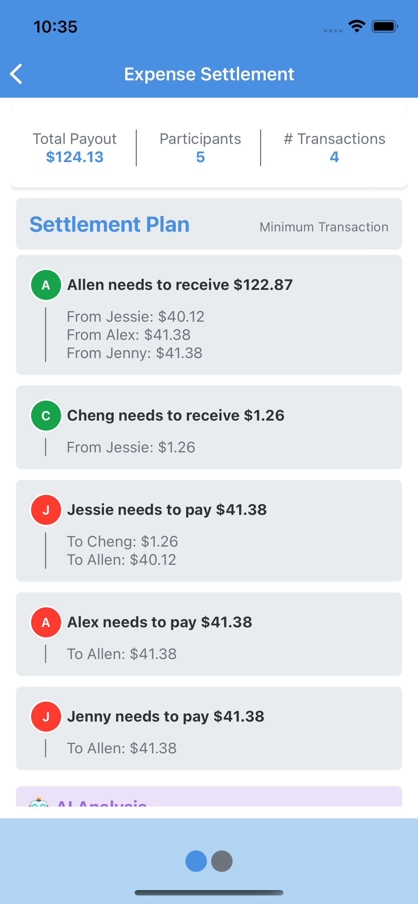

# DynamicBill

> A modern expense tracking and bill splitting app that makes group finances simple and transparent.

[](https://semver.org)
[](https://expo.dev)

## Overview

DynamicBill is a React Native application that helps groups manage shared expenses, track contributions, and settle debts efficiently. Whether you're planning a trip, managing household expenses, or organizing an event, DynamicBill makes it easy to keep track of who paid what and who owes whom.

## Features

### Core Features

- 🎯 **Activity Management**: Create and manage different activities/events with multiple participants
- 💰 **Expense Tracking**: Add and track expenses for each activity
- 🤝 **Smart Settlement**: Two settlement strategies available:
  - Minimum Transaction: Settles debts with the fewest possible transactions
  - Proportional One-To-Many: Distributes debts proportionally among participants
- 📊 **Visual Analytics**:
  - Contribution charts showing who paid what
  - Utilization tracking for budgeted activities
  - Settlement visualization
- 💵 **Budget Management**: Set and track budgets for activities
- ⚡ **Real-time Updates**: Automatic calculations of balances and settlements

### Technical Features

- 📱 Cross-platform (iOS & Android) support
- 🔄 Offline-first with local SQLite database
- 🎨 Modern UI with React Native Paper
- 📈 Interactive charts and visualizations
- 🔒 Type-safe with TypeScript

## Demo

### 🏠 Home Screen

The central hub for managing all your activities. Create new events or tap into existing ones to review expenses and statistics.

|                       Activities List                       |                    Create New Activity                     |
| :---------------------------------------------------------: | :--------------------------------------------------------: |
|  |  |

### 📊 Activity Detail

Each activity provides a detailed breakdown of spending with three statistical graphs:

|                          Contribution Distribution                           |                             Budget Utilization                             |                        Payment Overview                        |
| :--------------------------------------------------------------------------: | :------------------------------------------------------------------------: | :------------------------------------------------------------: |
|  |  |  |

### 🤝 Settlement Plan

Clear visualization of who should pay whom, with two settlement strategies available:

|                   Settlement Overview                   |
| :-----------------------------------------------------: |
|  |

## Tech Stack

- **Framework**: React Native with Expo
- **Language**: TypeScript
- **Database**: SQLite for local data storage
- **Charts**: React Native Gifted Charts
- **Navigation**: Expo Router
- **UI Components**: React Native Paper
- **State Management**: React Context API
- **Animations**: React Native Reanimated

## Getting Started

### Prerequisites

- Node.js (v14 or higher)
- npm or yarn
- Expo CLI
- iOS Simulator (for Mac) or Android Emulator
- Expo Go app (for physical device testing)

### Installation

1. Clone the repository:

   ```bash
   git clone https://github.com/yourusername/dynamic-bill.git
   cd dynamic-bill
   ```

2. Install dependencies:

   ```bash
   npm install
   ```

3. Start the development server:

   ```bash
   npx expo start
   ```

4. Run on your preferred platform:
   - Press `i` for iOS Simulator
   - Press `a` for Android Emulator
   - Scan QR code with Expo Go app

## License

© 2025 Cheng Shi. All rights reserved.

This software is proprietary and confidential. Unauthorized copying, distribution, or use of this software, via any medium, is strictly prohibited.

## Contact

- GitHub: [@c-shi](https://github.com/C-Shi)

## Acknowledgments

- [Expo](https://expo.dev)
- [React Native Paper](https://callstack.github.io/react-native-paper/)
- [React Native Gifted Charts](https://github.com/Abhinandan-Kushwaha/react-native-gifted-charts)
